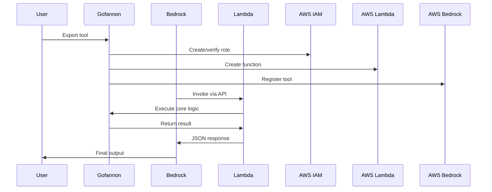

# AWS Bedrock Integration

## Overview

The AWS Bedrock integration enables Gofannon tools to be deployed as managed AI agents. This allows:

- Deployment of tools as serverless Lambda functions
- Automatic OpenAPI schema generation
- Bi-directional conversion between Gofannon and Bedrock tool formats
- Secure execution through IAM role management

## Features

1. **Automatic Lambda Packaging**
2. **OpenAPI Schema Generation**
3. **IAM Role Management**
4. **Cross-Framework Execution**
5. **Bi-directional Conversion**

## Installation

```bash  
pip install gofannon[aws]  # Install with AWS dependencies  
export AWS_ACCESS_KEY_ID=<your-key>  
export AWS_SECRET_ACCESS_KEY=<your-secret>  
```

## Exporting Tools to Bedrock

Convert any Gofannon tool to a Bedrock-ready package:

```python  
from gofannon.basic_math.addition import Addition  
import boto3

# Create tool instance
addition_tool = Addition()

# Export to Bedrock configuration
bedrock_config = addition_tool.export_to_bedrock()

print(f"Created Lambda ARN: {bedrock_config['lambdaArn']}")  
print(f"OpenAPI Schema: {bedrock_config['openAPISchema'][:100]}...")

# Create Bedrock Agent
bedrock = boto3.client('bedrock-agent')  
response = bedrock.create_agent(  
agentName='MathAgent',  
foundationModel='anthropic.claude-v2',  
agentTools=[bedrock_config]  
)  
```

This will:
1. Generate OpenAPI schema
2. Create Lambda function
3. Set up IAM execution role
4. Register tool with Bedrock

## Importing Bedrock Tools

Use Bedrock tools as native Gofannon functions:

```python  
from gofannon.base import BaseTool

# Sample Bedrock tool configuration
bedrock_tool_config = {  
"toolName": "bedrock-multiply",  
"openAPISchema": json.dumps({  
"openapi": "3.0.0",  
"paths": {  
"/multiply": {  
"post": {  
"requestBody": {  
"content": {  
"application/json": {  
"schema": {  
"type": "object",  
"properties": {  
"num1": {"type": "number"},  
"num2": {"type": "number"}  
}  
}  
}  
}  
}  
}  
}  
}  
}),  
"lambdaArn": "arn:aws:lambda:us-east-1:123456789012:function:multiply"  
}

# Import as Gofannon tool
tool = BaseTool()  
tool.import_from_bedrock(bedrock_tool_config)

# Use like native tool
result = tool.fn(num1=4, num2=5)  # Returns 20  
```

## Key Methods

### `BaseTool.export_to_bedrock()`
```python  
def export_to_bedrock(lambda_arn: str = None) -> dict  
```  
Converts the tool to Bedrock configuration. If no Lambda ARN is provided, creates a new Lambda function.

**Returns:**  
```json  
{  
"toolName": "addition",  
"description": "Adds two numbers",  
"openAPISchema": "...",  
"lambdaArn": "arn:aws:lambda:..."  
}  
```

### `BaseTool.import_from_bedrock()`
```python  
def import_from_bedrock(bedrock_tool: dict) -> None  
```  
Imports a Bedrock tool configuration. Requires:
- `toolName`: Unique identifier
- `openAPISchema`: OpenAPI 3.0 specification
- `lambdaArn`: Valid Lambda ARN

## Execution Flow



## Error Handling

Common errors and solutions:

1. **Lambda Creation Failed**
    - Verify IAM permissions
    - Check AWS region configuration
    - Ensure Python 3.9 runtime is available

2. **Schema Validation Errors**
    - Use `print(tool.definition)` to verify parameters
    - Ensure OpenAPI spec matches function parameters

3. **Timeout Issues**
    - Increase Lambda timeout:  
      ```python  
      tool.export_to_bedrock(lambda_arn="...", timeout=60)  
      ```

## Best Practices

1. **Reuse Lambdas** for frequently used tools
2. **Validate Schemas** using `tool.validate_definition()`
3. **Monitor Usage** through CloudWatch metrics
4. **Use Named Profiles** for multiple AWS accounts  
   ```python  
   boto3.setup_default_session(profile_name='dev')  
   ```

## Example Workflow

1. Develop tool locally:  
   ```python  
   from gofannon.basic_math.division import Division

   div = Division()  
   print(div.fn(10, 2))  # 5.0  
   ```

2. Deploy to Bedrock:  
   ```python  
   bedrock_config = div.export_to_bedrock()  
   ```

3. Use in production:  
   ```python
   # Different environment
   prod_tool = BaseTool()  
   prod_tool.import_from_bedrock(bedrock_config)  
   print(prod_tool.fn(20, 4))  # 5.0  
   ```

## Limitations

1. **Cold Starts** - Lambda initialization delays
2. **Regional Deployment** - Tools are region-specific
3. **Input Validation** - Bedrock may not validate parameters
4. **Output Size** - Lambda response payload limit (6MB)  